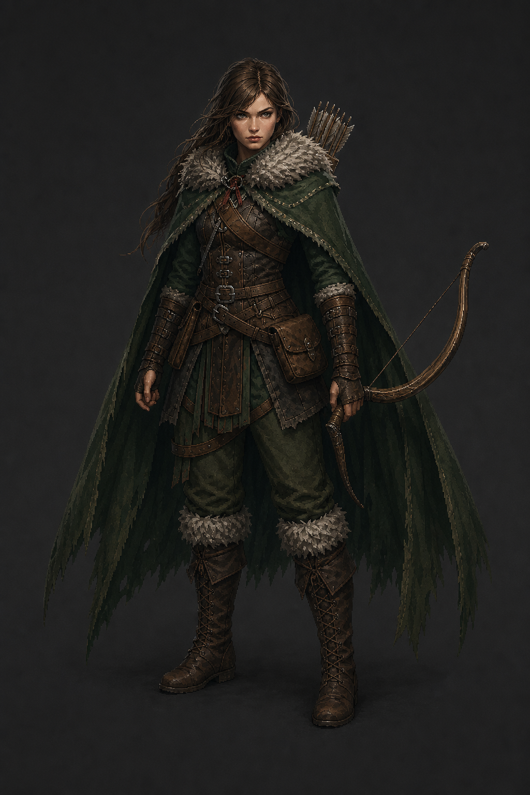
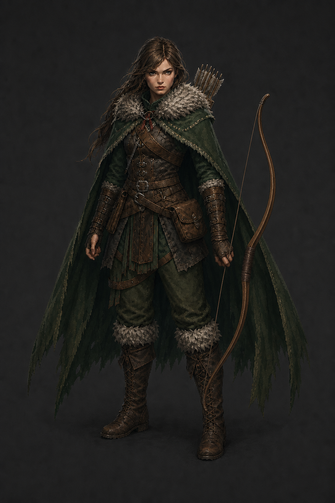
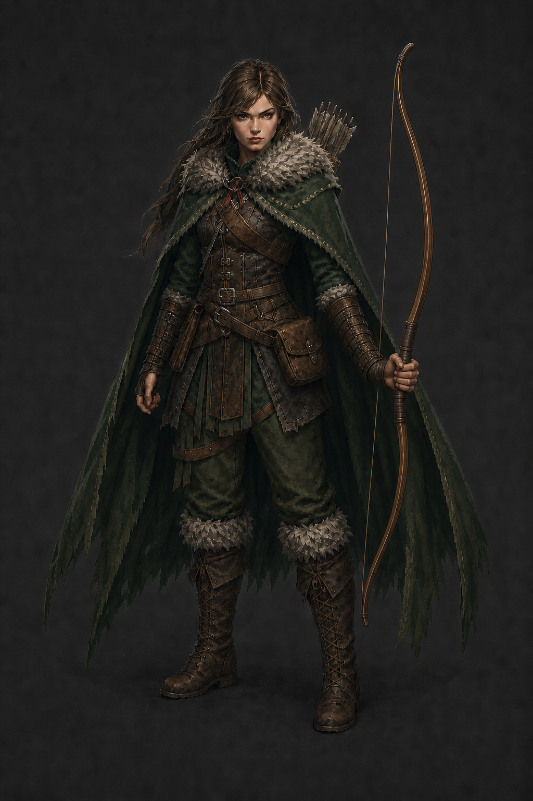

# Archer base refinement — design pass

Generated with Codex's built-in ImageGen tool on 2026-07-31.

**Design status:** Approved by the owner on 2026-07-31. Use
`03_severed_thread_ranger_correct_grip.png` as the identity anchor for
production. It has not yet been rotated, animated, keyed, or wired.

## Candidate 01 — Severed-Thread Ranger (rejected bow geometry)

The character design was retained, but this first render failed equipment QA:
the bow's lower limb forked into a duplicate curve and the string terminated
near the grip instead of connecting the two limb-tip nocks. It must not be used
as a production reference.

## Candidate 02 — Correct bow, rejected grip

Candidate 02 changes only the bow. It has exactly one continuous wooden body,
one upper limb, one lower limb, one central leather-wrapped grip, and one taut
string running directly from the upper tip nock to the lower tip nock. No arrow
is nocked. The Archer's identity, costume, pose, quiver, snapped cord, palette,
and presentation remain locked.

The bow itself is coherent, but equipment QA rejected this render because the
right hand closes around the string while the wooden grip sits beside it. It
must not be used as a production reference.

## Active Candidate 03 — Correct bow and hand grip

Candidate 03 corrects the remaining contact error:

- The leather-wrapped wooden riser passes directly through the right palm
- Four fingers and the thumb visibly close around the thick grip
- Solid wood emerges above and below the fist
- The string remains a separate uninterrupted tip-to-tip chord
- A visible air gap separates the string from fingers, palm, wrist, and grip

This is the approved Archer production anchor.

This is a faithful re-presentation of the existing Archer rather than a
redesign. It preserves the same brown-haired woman, visible face, broad
gray-brown fur mantle, weathered forest-green cloak, layered practical leather,
wooden recurve bow, back quiver, travel gear, green trousers, and fur-trimmed
boots.

The concept changes only what future sprite production needs:

- Neutral idle with the bow lowered and no arrow nocked
- Clearer leg separation beneath the cloak
- Slightly simplified belt clutter
- One short snapped dark-red cord at the plain iron throat clasp, a restrained
  reference to the Archer's severed bond

The cord is not magical and must never become an aura, floating thread, or
dominant red accent. Storm, Venom, and Hunt remain effect languages rather than
base-costume coding.

## Built-in ImageGen prompt direction

Image 1 was `game/assets/sprites/class_splash_archer.png` and was locked as the
identity and costume reference. The prompt requested an isolated full-body
3/4-front neutral character anchor in high-detail mature dark-fantasy pixel
art. It explicitly preserved face, hair, fur mantle, green cloak, leather,
bow, quiver, palette, and grounded demeanor while prohibiting magic, active
aiming, extra weapons, hood, helmet, animal companion, scenery, and
high-fantasy elven redesign.

### Corrective edit prompt

Candidate 01 was the edit target. The prompt replaced only the malformed bow,
specified physically coherent bow anatomy and a single uninterrupted tip-to-tip
string, and prohibited forked limbs, duplicate curves, a second bow, detached
wood, split grips, loose strings, strings ending at the hand, impossible
intersections, and arrows. Every character and costume element was explicitly
locked.

Candidate 02 was then used as the second corrective edit target. The prompt
changed only right-hand contact and bow placement, required the wooden grip to
pass through the closed palm with wood visible above and below the fist, and
required a clear gap between the hand and the bowstring. All character,
costume, quiver, lighting, and presentation details remained locked.
