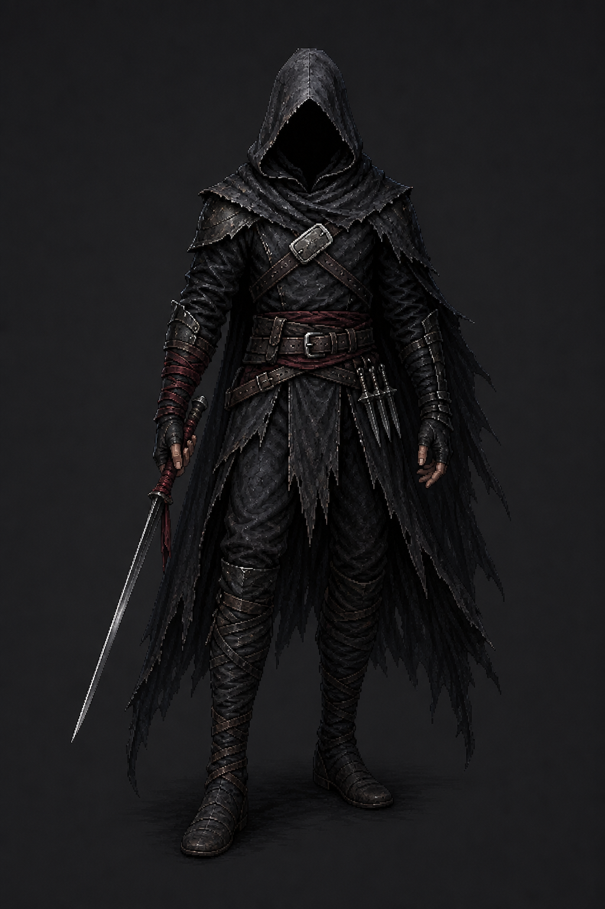

# Assassin base refinement — design pass

Generated with Codex's built-in ImageGen tool on 2026-07-31.

**Design status:** Approved by the owner on 2026-07-31. Use
`01_erased_name.png` as the identity anchor for production. It has not yet been
rotated, animated, keyed, or wired.

## Candidate 01 — The Erased Name

This pass retains the existing Assassin's empty hood, lean body, divided black
cloak, sparse armor, wrapped legs, and unrestricted silhouette while replacing
generic rogue signals with specific Crownless identity.

Refinements:

- Removes the glowing blue eyes; the hood is absolute featureless darkness
- Establishes one long narrow Stab blade as the primary hand-held weapon
- Keeps three smaller throwing knives together at the opposite hip for Fan of
  Knives
- Uses restrained dried-blood/Ember-red cord on one forearm and the primary
  blade grip
- Replaces the ordinary chest identity with a deliberately blank, roughly
  filed clasp where a name or insignia was erased
- Separates charcoal cloth, dull black leather, and sparse cold-gray metal

No smoke, aura, shadow tendrils, or supernatural face should be added to the
base. The consumption theme remains a consequence expressed through story and
effects, not permanent visual noise.

## Built-in ImageGen prompt direction

Image 1 was `game/assets/sprites/class_splash_assassin.png` and supplied the
silhouette and costume lineage. The prompt locked the empty hood, lean body,
divided cloak, sparse dark armor, wrapped legs, and muted palette. It explicitly
required no eyes or face, exactly one hand-held long stabbing blade, three
hip-mounted throwing knives, one erased clasp, restrained red bindings, and no
second sword, magic, smoke, aura, scenery, or bulky armor.
