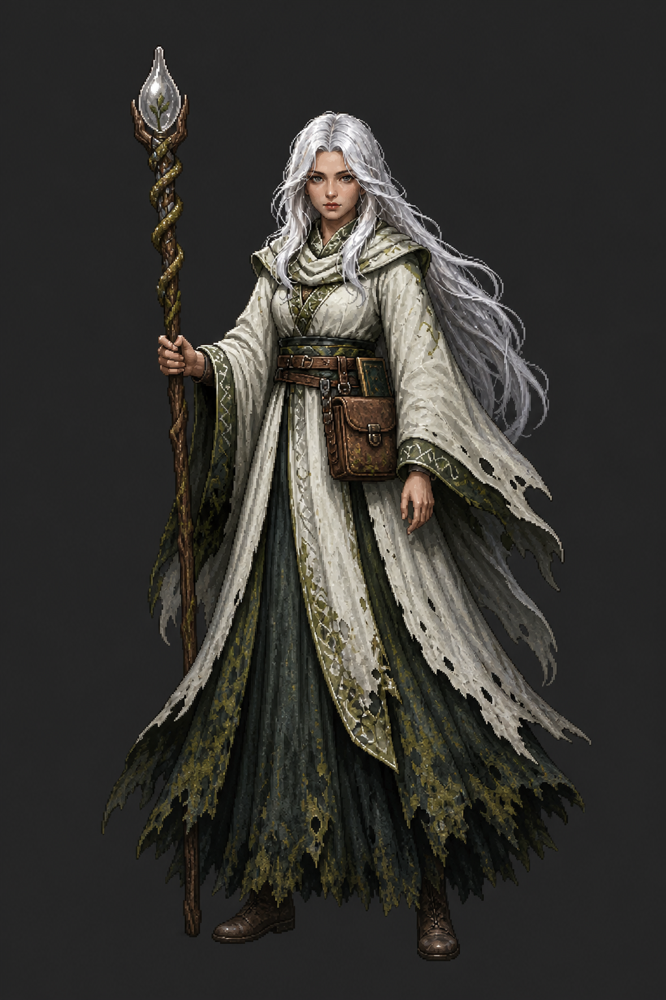

# Mage base refinement — design pass

Generated with Codex's built-in ImageGen tool on 2026-07-31.

**Design status:** Approved by the owner on 2026-07-31. Use
`01_blighted_healer.png` as the identity anchor for production. It has not yet
been rotated, animated, keyed, or wired.

## Candidate 01 — Blighted Healer

This pass preserves the existing Mage's strongest idea: a composed white-haired
healer whose clean ivory outer robes conceal green-black contamination and
decay beneath.

Refinements:

- Replaces the strongly Ice-coded blue crystal with a cloudy colorless glass
  focus containing one tiny failed-healing green inclusion
- Adds one weathered remedy satchel and one slim closed treatment journal
- Clarifies the contaminated underskirt and lower cuffs
- Uses a calm grounded staff idle with no active spell

The glass inclusion is an object detail, not a constant glow. Fire, Ice, and
Wind remain effect families rather than permanent costume identities.

## Built-in ImageGen prompt direction

Image 1 was `game/assets/sprites/class_splash_mage.png` and was locked as the
identity and costume reference. The prompt preserved the face, long white hair,
ivory healer robes, sage trim, green-black underlayers, worn hems, wooden staff,
and tall silhouette. It changed only the staff focus and added the small
healer's kit. It prohibited elemental effects, blue magic, aura, pristine
princess styling, necromancer language, armor, and extra weapons.
