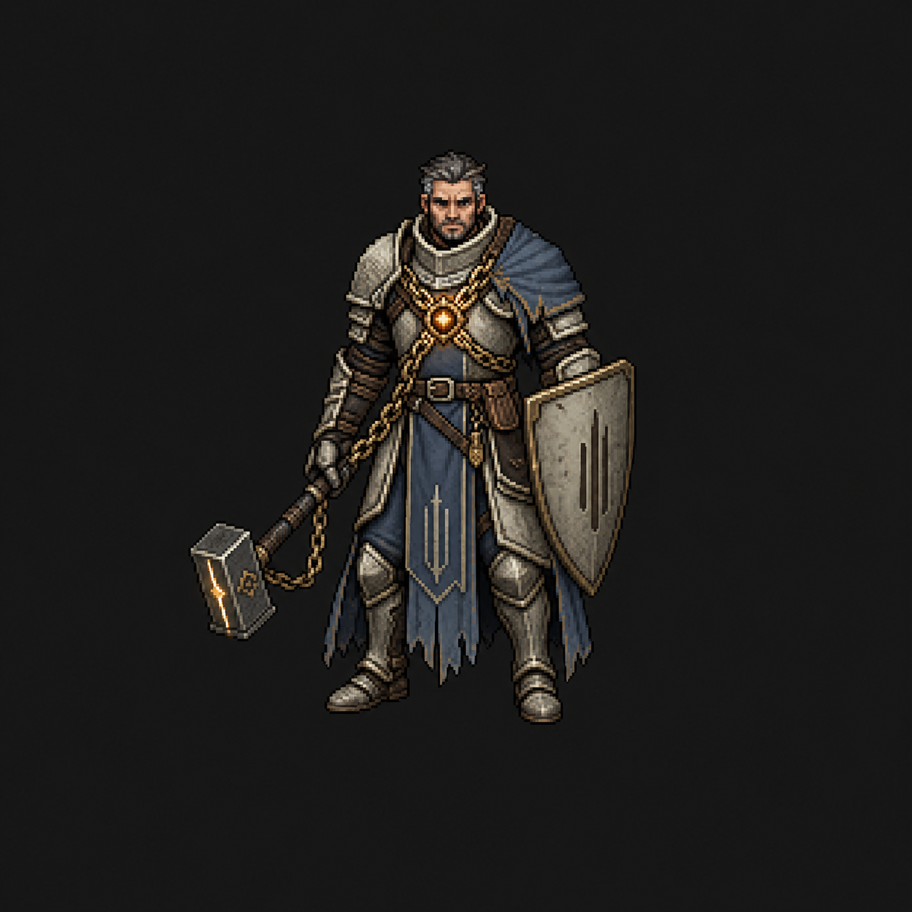
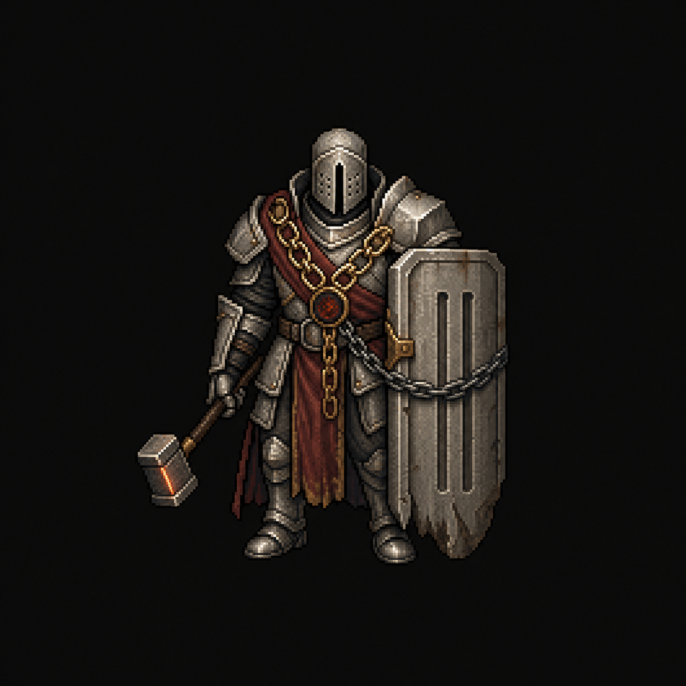
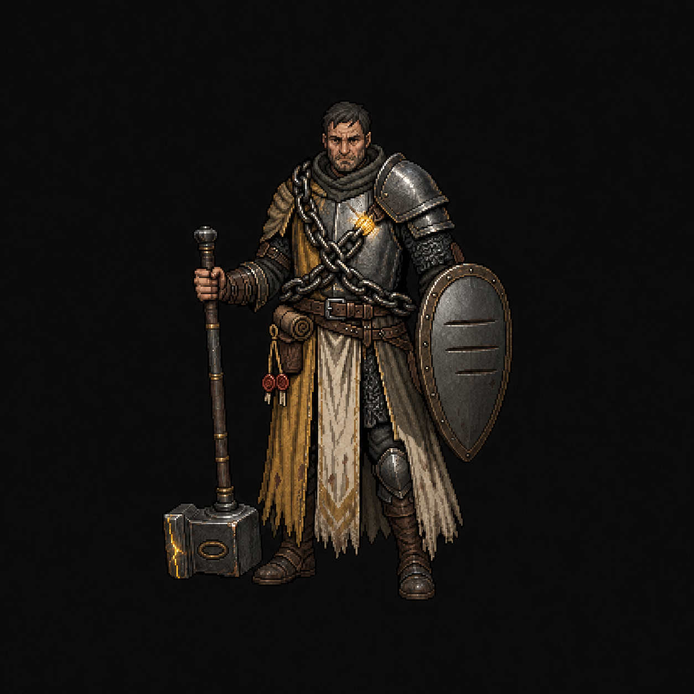

# Paladin base redesign — concept round

Generated with Codex's built-in image tool on 2026-07-30. These are design
proposals, not runtime-ready replacements: each is a 1254 × 1254 concept sprite
on a charcoal presentation background. The selected body still needs a
transparent 8-direction idle/walk/run/action generation and the normal
`verify_art.py` installation checks.

## Lore basis

- The Paladin begins as an arbiter interrupted during a grain-hoarding hearing,
  not as a church crusader.
- A supernatural verdict-chain coils around his heart and tries to speak before
  he rules.
- Conviction alternates Holy mercy/protection with Retribution and chain-pull
  judgment.
- His hammer carries an Ember and bears the same old foundry maker's mark as
  Vaelscar's binding works.
- His arc is learning to hear the chain without surrendering judgment to it.
- The base should not borrow the black/gold eclipse, broken halo, wings, or red
  corruption language reserved for the Paladin's premium skins.

## Design 1 — Oathbound Arbiter

Open-faced former magistrate in aged ivory and pale steel, with a muted
judicial-blue mantle and tabard. Six antique-gold links converge on an Ember
socket at the sternum; a practical marked warhammer and compact kite shield make
both sides of the kit readable. This is the recommended base direction because
the face, palette, and asymmetry separate him cleanly from every other class.

Prompt direction: mature non-chibi Crownless pixel art; one south-facing
three-quarter male Paladin; stern, tired, humane middle-aged face; no hood or
full helm; battle-worn ivory/pale-steel plate; judicial-blue tabard and
asymmetric magistrate mantle; six large chain links crossing the heart; exactly
one square marked warhammer with a restrained white-gold Ember seam; exactly one
compact kite shield with a simple verdict-bar mark; near-black presentation
background. Avoid generic holy-knight, cross, halo, wings, crown, flail,
lantern, all-black crusader, Eclipse Knight, and Fallen Arbiter motifs.

## Design 2 — Walking Tribunal

An enclosed pale-iron gate of a knight: courthouse-arch visor, faded oxblood
judicial sash, six-link chain of office, short gavel-hammer, and a tall
writ-tablet shield. This version sells Aegis and protection most strongly, but
its mass puts it closest to the Warrior silhouette.

Prompt direction: mature non-chibi Crownless pixel art; one south-facing
three-quarter male Paladin; weathered pale-iron greathelm with a single severe
verdict slit; layered slab plate like a portable gate; faded oxblood sash; six
oversized brass links terminating at an Ember seal; exactly one short
square-headed gavel-warhammer; exactly one tall battered courthouse-door shield
with parallel tally incisions; near-black presentation background. Avoid
Templar/cathedral language, cross, halo, wings, crown, skulls, flail, lantern,
black/gold, and corruption motifs.

## Design 3 — Chain-Bearer Pilgrim

The exiled road judge: visible weathered face, practical asymmetrical
half-plate, rain-frayed bone and saffron stole, blackened chain pulled tight
around the heart, a grounded staff-like hammer, and a modest travel shield. This
is the most intimate lore read and the least conventional Paladin, though the
torso chain will need simplification when reduced to the runtime sprite scale.

Prompt direction: mature non-chibi Crownless pixel art; one south-facing
three-quarter male Paladin; tired visible face and lowered coif; battered
pale-steel half-plate over charcoal mail and travel leathers; patched saffron
and bone magistrate stole; six thick blackened-brass links around an Ember
brand; exactly one long square warhammer grounded like a walking staff; exactly
one modest heater shield; writ case and wax cords at the belt; near-black
presentation background. The final correction replaces cross-like marks with
three horizontal verdict tallies on the shield and a closed chain-link emblem
on the hammer. Avoid generic holy-knight, cross, halo, wings, pristine plate,
flail, lantern, all-black, Eclipse Knight, and Fallen Arbiter motifs.

