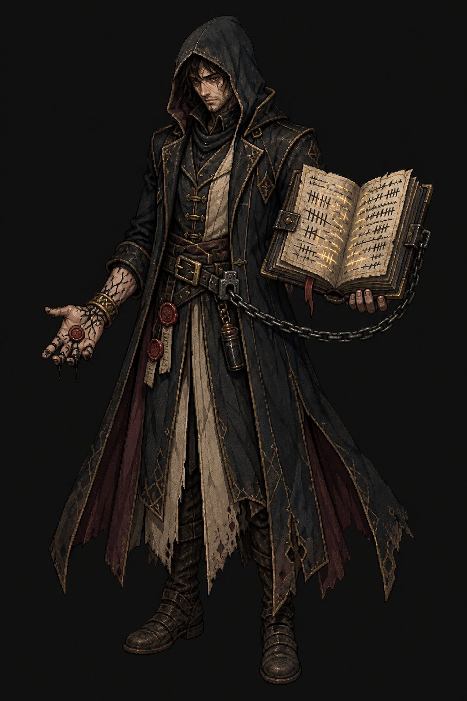
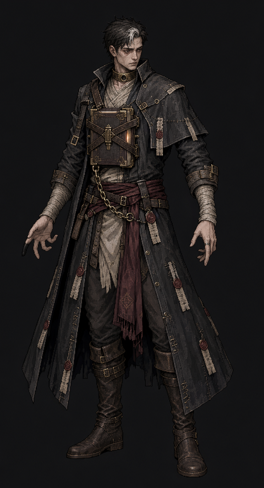
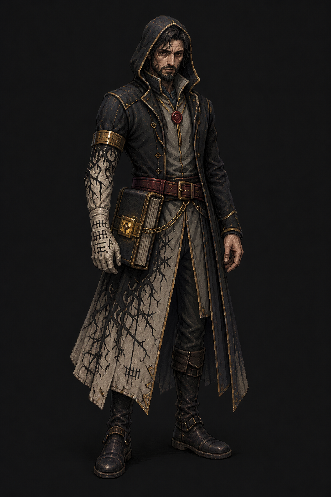
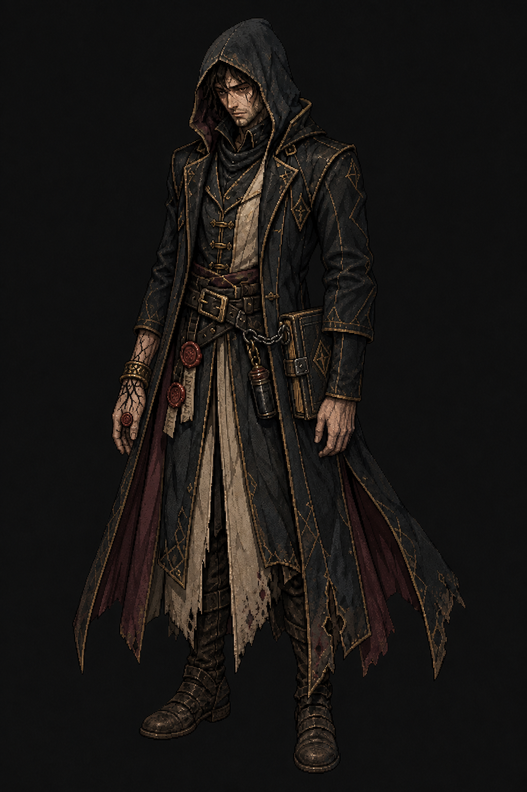
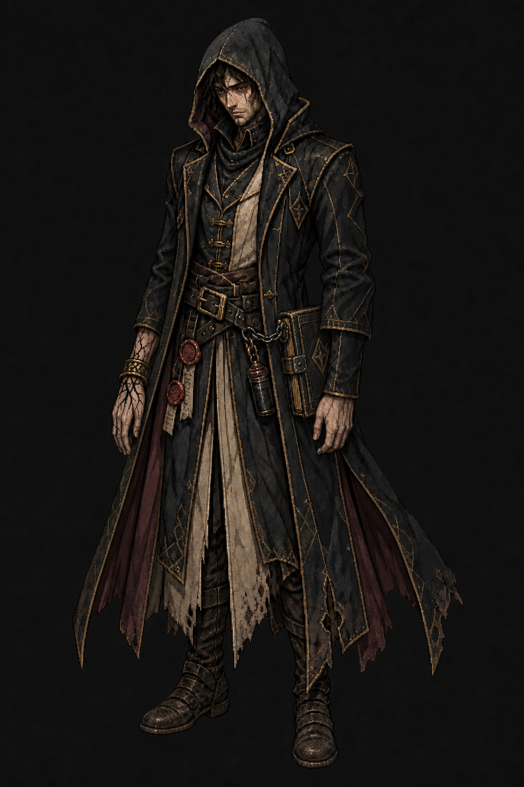

# Warlock base redesign — concept round

Generated with Codex's built-in ImageGen tool on 2026-07-30. These are design
proposals, not runtime-ready assets. No rotation, animation, transparency, or
game wiring has begun.

**Design status:** Approved by the owner on 2026-07-30. Use
`05_ledgerbound_debtor_clean_hand.png` as the identity anchor for production.

## Lore basis

- The Warlock's Ember is borrowed rather than inherited.
- The pact is with something outside the world's edge, and the debt is real.
- Virtue is **Accountability**; temptation is the **debt spiral**: borrow more
  power to repair the consequences of the last borrowing.
- The tome keeps perfect books in handwriting that becomes more like the
  bearer's every year.
- The base must support Curse, Pact, and Void without looking permanently tied
  to generic purple magic.
- The former floating skull reads as necromancy, creates continuity failures,
  and is not part of the class's actual narrative identity.

## Candidate 1 — The Ledgerbound Debtor

The strongest “living debt” read: a wary hooded scholar with an enormous open
ledger chained to the belt, abstract self-writing tallies, and contract ink
spreading through one hand until stopped by a countersign band.

Prompt direction: high-detail dark-fantasy pixel-art character concept;
realistic adult proportions; tired visible face under a lowered hood; black
scholar's coat, parchment panels, aged gold, muted burgundy; exactly one
part-open chained ledger; ink-stained bare hand with a broken wax seal in the
palm; charcoal presentation background. Avoid skulls, flames, floating
companions, staffs, necromancer motifs, and dominant purple.

## Candidate 2 — The Countersigned Pilgrim

The most original and readable silhouette: the locked tome is physically
strapped over the heart in a brass-edged chest harness. Contract strips serve
as repairs and records rather than loose magical ribbons. A countersign collar
has one empty socket, implying collateral promised but not yet taken.

Prompt direction: high-detail dark-fantasy pixel-art character concept;
realistic adult proportions; pale tired visible face, hood down, one premature
white streak; practical charcoal pilgrim coat, parchment wrapping, aged brass,
muted wine-red sash; exactly one closed chest-bound tome with crossed straps
and a short belt chain; restrained wax-sealed contract patches; charcoal
presentation background. Avoid skulls, fire, floating objects, cult-priest
language, clutter, and dominant purple.

## Candidate 3 — The Accruing Debt

The clearest compounding-cost read: a hip-holstered closed ledger slowly erases
the color from one side of the coat and arm. A brass band stops the precise ink
spread before it reaches the body. This is the easiest carried-object setup to
animate, but the design is less immediately iconic than Candidate 2.

Prompt direction: high-detail dark-fantasy pixel-art character concept;
realistic adult proportions; lean mature open-faced traveler in soot black,
parchment gray, aged gold, and muted burgundy; exactly one locked ledger fixed
at the hip; restrained one-sided ink erosion stopped by a brass arm band;
single wax counterseal at the sternum; charcoal presentation background. Avoid
skulls, undead features, flames, floating objects, tentacles, and dominant
purple.

## Selected synthesis — Ledgerbound Debtor, closed idle

Owner direction:

- Candidate 1's design is the selected identity.
- Candidate 1's open-book idle was rejected because the character is not
  continuously casting.
- Candidate 3 supplies only the relaxed idle posture and closed hip carry.

The selected anchor preserves Candidate 1's exact young tired face, lowered
hood, black-and-aged-gold scholar's coat, parchment inner panels, muted
burgundy lining, wax seals, ink vial, branching contract-ink hand, countersign
bands, and chained battered ledger. The ledger is now closed and fixed
vertically at the left hip on a short functional chain.

### Equipment continuity rule

- **Idle, walk, and run:** ledger closed at the left hip; short chain remains
  attached to the same belt point.
- **Cast and attacks:** ledger is drawn into the hands and opened for the
  action; recovery explicitly closes it and returns it to the left hip.
- **Death:** ledger remains tethered to the left side of the body; it never
  floats away, disappears, or changes sides.

Do not add Candidate 2's chest harness, Candidate 3's pale spreading coat
corruption, or the former floating skull. Keep purple, red, and blue magic in
the Curse, Pact, and Void effects rather than the base costume.

### Final built-in ImageGen edit prompt

Image 1 was Candidate 1 and the identity-preserving edit target. Image 2 was
Candidate 3 and supplied pose/book placement only. The edit changed only the
idle pose and book state: the ledger was closed, moved to the left hip, attached
by one short chain, and both arms were relaxed. Candidate 1's face, hair, hood,
coat, palette, seals, ink vial, inked hand, countersign bands, boots, and body
proportions were explicitly locked. The prompt prohibited Candidate 3's beard,
white hair, costume, chest seal, parchment arm, pale coat corruption, and all
necromancer motifs.

## Final cleaned anchor

The small red counterseal embedded on the back of the inked hand was removed
after review because it read as a literal button at character and sprite
scale. The branching contract ink already communicates the pact cost without
that extra circular object.

This is a precise cleanup of the selected synthesis, not a redesign. The face,
hood, pose, coat, palette, countersign wrist bands, other wax seals, chained
closed ledger, ink vial, proportions, and background are unchanged. Use
`05_ledgerbound_debtor_clean_hand.png` as the final identity anchor for future
rotation and sprite-sheet production.

### Final cleanup prompt

Image 1 was `04_ledgerbound_debtor_closed_idle.png`. The edit removed only the
small red wax-seal/button from the back of the ink-marked hand, reconstructed
natural skin beneath it, and continued the fine branching black contract ink
through the repaired area. Every other design element was explicitly locked.
