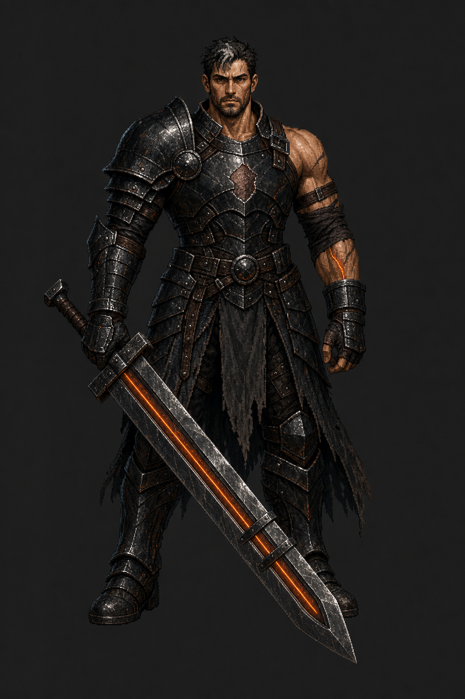
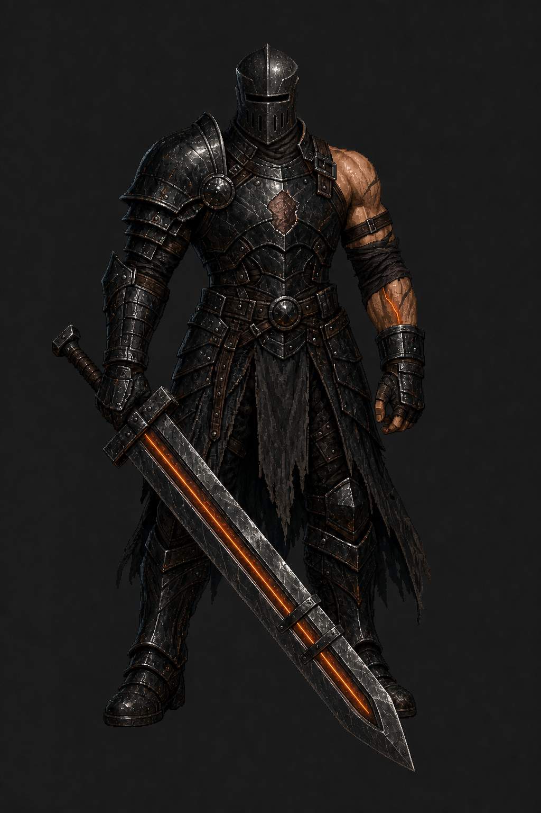

# Warrior Base Redesign — Active Requirements

**Reset:** 2026-07-30 after rejection of the first concept round.

**Design status:** Approved by the owner on 2026-07-31. Use
`03_emberbound_heir_restrained_helm.png` as the identity anchor for production.

The first three concepts were moved to
`backup/class_drafts/warrior_base_rejected_2026-07-30_npc_material/`. They are
good NPC material but are not candidates for the playable Warrior.

## Locked requirements

- The Warrior **must carry a sword**. An axe or pole-arm is not acceptable for
  the base design.
- The silhouette must read as a player hero, not a generic guard, laborer,
  linekeeper, or town NPC.
- The face should remain visible enough to communicate a person resisting the
  Ember.
- The character remains broad, physically powerful, and grounded.
- The design must express protection versus tyranny and the danger of a
  blackout without presenting the Warrior as permanently corrupted.
- Fury, Bulwark, and Earth remain ability/theme expressions; the base cannot be
  permanently Fury-coded.
- The design must be clearly distinct from the Paladin's hammer, shield, chain,
  judicial blue, and religious/judicial silhouette.

## Required signature idea for the next round

The next design should place the narrative identity in the **sword and its
restraint system**, not in generic armor:

- One distinctive broad sword, carried low and under control
- A visible restraint mechanism around the lower blade, guard, scabbard, or
  sword arm
- Only one restrained Ember seam
- A physically removed Vargoth-era insignia or blank scar where authority used
  to be
- Practical armor and traces of the Warrior's careful working years, but not
  enough carpenter or laborer props to make him read as an NPC

No new rotation or animation work begins until a new sword-first anchor design
is approved.

## Rejected sword-first attempt — The Restrained Blade

The Restrained Blade was also rejected as a playable design because it reads as
an elite NPC. It is preserved at
`backup/class_drafts/warrior_restrained_blade_2026-07-30_elite_npc_material/`.

The sword restraint, removed insignia, and controlled stance were useful, but
the charcoal brigandine, long oxblood coat, and grounded veteran treatment
still dominated the read. Adding a signature sword to an elite-soldier body
does not create a player-class identity.

## Active candidate — The Emberbound Heir

This pass deliberately evolves the original Warrior instead of replacing him
with another practical veteran:

- Open, human face replaces the closed raid-boss helmet
- Broad, exaggerated selectable-hero silhouette remains
- Exactly one enormous black-iron greatsword preserves the iconic class read
- The sword's Ember is confined to a narrow central fuller
- Three black restraint staples interrupt the seam
- A single forearm scar terminates beneath a restraint cuff
- The chiseled chest mark retains the repudiated Vargoth history
- Asymmetric half-plate, one exposed arm, and a short split battle skirt avoid
  both Paladin regalia and elite-guard uniform language

This is an approval-stage character anchor only. No rotations, animations, or
runtime wiring should begin until the owner accepts the design.

## Approved helmet variant — The Restrained Helm

Owner review found that Candidate 02's square-jawed masculine face occupied too
much of the same visual territory as the accepted Oathbound Arbiter Paladin.
The old Warrior's closed helmet was also identified as the strongest source of
his unique intimidation.

Candidate 03 therefore changes only the head treatment:

- Fully enclosed battered black-iron helmet
- Narrow, completely unlit sight slit
- Simple central ridge echoing the sword fuller
- Practical lower-face breathing cuts and fitted leather neck seal
- No face, hair, glow, horns, crown, plume, spikes, skull, ornament, or
  Paladin silver/gold language

The asymmetric half-plate, exposed scarred arm, cold armor, and tightly
contained sword Ember remain unchanged. These human-scale elements are the
boundary that keeps the closed helmet intimidating without reverting to the
old molten raid-boss design.

### Canonical meaning

The helmet is self-imposed restraint, not Vargoth regalia. The Warrior wears a
fully enclosed, unlit face because he does not trust what happens when his
memory goes dark. The exposed arm keeps the person and the cost visible. This
meaning is canonized in `DESIGN.md`.

### Built-in ImageGen prompt direction

The original Warrior splash was used as visual lineage rather than an exact
repaint. The prompt preserved the broad silhouette, enormous black-iron
greatsword, black-and-coal-orange palette, and controlled menace. It rebuilt
the character with a visible weathered face, asymmetric half-plate, one
partially exposed arm, short split battle skirt, chiseled-away chest insignia,
one contained sword-fuller Ember seam interrupted by three restraint staples,
and one matching forearm scar. It explicitly prohibited generic soldier,
guard, mercenary, elite NPC, miniboss, king, villain, long coat, helmet, cape,
shield, Paladin motifs, all-over lava cracks, flaming edge, aura, extra
weapons, and marching.

For Candidate 03, Candidate 02 was the edit target. The prompt replaced only
the exposed head, face, and hair with the restrained helmet and explicitly
locked the body, armor, exposed arm, chest scar, stance, sword, three blade
staples, Ember fuller, lighting, framing, palette, and background.
